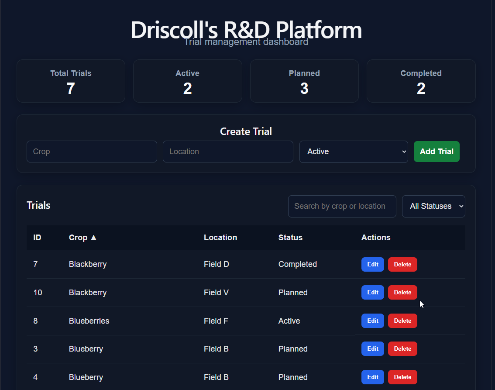
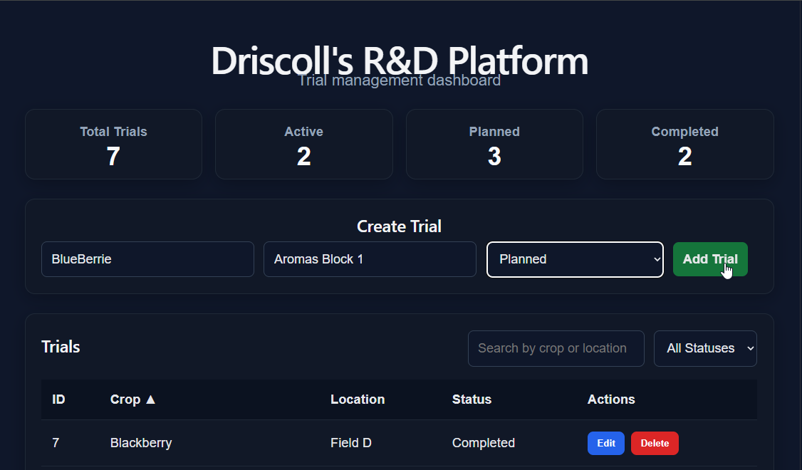
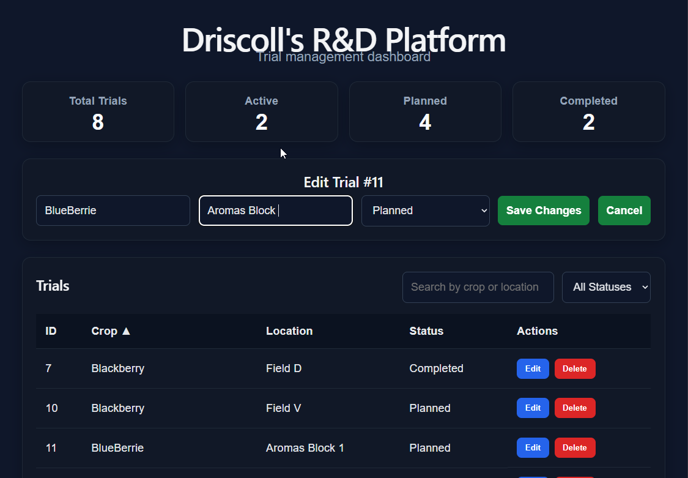
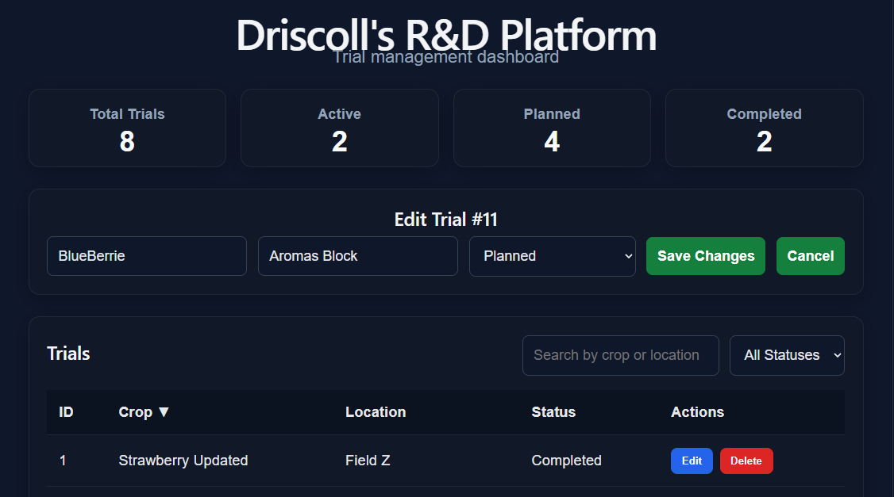

# 🍓 Driscoll’s R&D Platform (AI-Assisted Trial Management)

A full-stack R&D workflow platform designed to simulate how agricultural research teams manage and analyze field trials.

This application connects structured data, APIs, and an AI-assisted decision layer to support real-world research workflows.

---

## 🚀 Key Features

- Create, edit, and manage field trials
- R&D-focused data model (crop, variety, objective, season)
- Real-time dashboard with summary metrics
- Search, filter, and sort trial data
- PostgreSQL-backed persistent storage
- RESTful API with FastAPI
- Interactive API documentation (Swagger)

### 🤖 AI Decision Support

- Analyzes trial notes to recommend status
- Provides confidence scoring
- Generates contextual explanations
- Suggests next actions
- Integrates directly into the trial creation workflow

---

## 📸 Screenshots

### Dashboard


### Create Trial


### Edit Trial


### AI Recommendation


---

## 🏗️ Architecture

```text
React (Frontend)
        ↓
FastAPI (Backend API)
        ↓
PostgreSQL (Database via Docker)